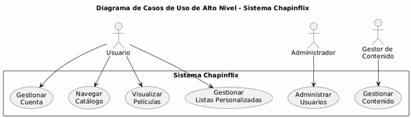
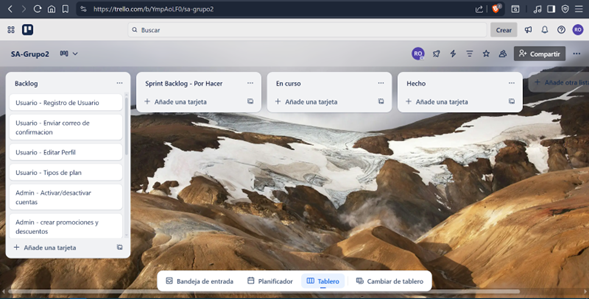

# Sistema Chapinflix

## Descripción del Proyecto

Chapinflix es una plataforma de streaming de video que permite a los usuarios visualizar contenido multimedia organizado por categorías. El sistema incluye funcionalidades de gestión de usuarios, catálogo de contenido, listas personalizadas y panel administrativo.

## Tabla de Contenidos

- [Requerimientos Funcionales](#requerimientos-funcionales)
- [Requerimientos No Funcionales](#requerimientos-no-funcionales)
- [Arquitectura del Sistema](#arquitectura-del-sistema)
- [Modelo de Datos](#modelo-de-datos)
- [Casos de Uso](#casos-de-uso)
- [Diagramas de Secuencia](#diagramas-de-secuencia)
- [Metodología de Desarrollo](#metodología-de-desarrollo)
- [Tecnologías](#tecnologías)
- [Instalación](#instalación)

## Requerimientos Funcionales

### RF01 - Gestión de Usuarios
- **RF01.1**: El sistema debe permitir el registro de nuevos usuarios con campos obligatorios
- **RF01.2**: El sistema debe enviar un correo de confirmación con caducidad de 2 minutos
- **RF01.3**: El sistema debe permitir el login con username/correo y contraseña
- **RF01.4**: El sistema debe permitir la edición de datos del perfil
- **RF01.5**: El sistema debe soportar hasta 5 perfiles por cuenta de usuario
- **RF01.6**: El sistema debe manejar dos categorías: usuario gratuito y suscripción mensual

### RF02 - Control Administrativo
- **RF02.1**: El administrador debe poder activar/desactivar cuentas de usuarios
- **RF02.2**: El administrador debe poder crear cuentas manualmente
- **RF02.3**: El administrador debe poder gestionar promociones y descuentos
- **RF02.4**: El administrador debe poder dar seguimiento a usuarios reportados
- **RF02.5**: El sistema debe tener un login separado para administradores

### RF03 - Gestión de Contenido
- **RF03.1**: El sistema debe permitir la carga individual y masiva de contenido
- **RF03.2**: El sistema debe permitir gestionar la disponibilidad del contenido por fechas
- **RF03.3**: El sistema debe diferenciar contenido para usuarios gratuitos y premium
- **RF03.4**: El sistema debe almacenar metadata del contenido

### RF04 - Catálogo y Navegación
- **RF04.1**: El sistema debe mostrar películas por categorías y subcategorías
- **RF04.2**: El sistema debe implementar visualización por carruseles
- **RF04.3**: El sistema debe mostrar secciones especiales (Vistos recientemente, Más populares, Top 15, etc.)
- **RF04.4**: El sistema debe mostrar recomendaciones en el encabezado con preview

### RF05 - Visualización de Contenido
- **RF05.1**: El sistema debe mostrar página de detalles con sinopsis completa
- **RF05.2**: El sistema debe mostrar imágenes previas de la película
- **RF05.3**: El sistema debe mostrar información relacionada (estudio, duración, clasificación)

### RF06 - Listas Personalizadas
- **RF06.1**: Los usuarios deben poder agregar películas a "Mis Favoritos"
- **RF06.2**: Los usuarios deben poder agregar películas a "Ver luego"
- **RF06.3**: Los usuarios deben poder eliminar elementos de sus listas
- **RF06.4**: El sistema debe mostrar estas listas como carruseles en la página principal

## Requerimientos No Funcionales

### RNF01 - Rendimiento
- **RNF01.1**: El tiempo de carga de la página principal no debe exceder 3 segundos
- **RNF01.2**: El sistema debe soportar al menos 100 usuarios concurrentes

### RNF02 - Seguridad
- **RNF02.1**: Las contraseñas deben almacenarse encriptadas
- **RNF02.2**: El token de confirmación de email debe expirar en 2 minutos
- **RNF02.3**: Las sesiones deben manejarse con JWT o similar
- **RNF02.4**: Debe implementarse HTTPS en todas las comunicaciones

### RNF03 - Usabilidad
- **RNF03.1**: El sitio debe ser responsive
- **RNF03.2**: La interfaz debe ser intuitiva y amigable
- **RNF03.3**: Los mensajes de error deben ser claros y orientativos

### RNF04 - Escalabilidad
- **RNF04.1**: Debe poder escalar horizontalmente
- **RNF04.2**: Las bases de datos deben estar separadas por dominio
- **RNF04.3**: El sistema debe soportar crecimiento gradual de usuarios
- **RNF04.4**: Los contenedores deben poder replicarse según demanda

### RNF05 - Disponibilidad
- **RNF05.1**: El sistema debe tener una disponibilidad del 99%
- **RNF05.2**: Debe implementarse manejo de errores y recuperación

## Casos de Uso

### Casos de Uso de Alto Nivel

### Casos de uso detallados

## Diagrama de Alto Nivel

## Arquitectura del Sistema

### Diagrama de Arquitectura

## Modelo de Datos

### Base de Datos de Catálogo

### Base de Datos de Autenticación

### Base de datos de interaccion

### Base de datos de Series

## Metodología a utilizar
Como Grupo #2 decidimos utilizar una metodología Scrum+Kanban donde tomamos los sprint de Scrum y el tablero de Kanban para poder visualizar las tareas asignadas a cada integrante del grupo y el avance de las mismas, de esta manera podemos tener pequeñas reuniones diarias entre el grupo para exponer nuestro avances o bloqueos al realizar el proyecto.

#### Tablero al inicio del sprint

#### Tablero al durante del sprint

#### Tablero al finalizar el sprint

### Reunion de Sprint Planning
Se realizó la reunión inicial para definir el backlog de las funcionalidades importantes del sistemas así como la asignación de las tareas al equipo de desarrollo.

### Reuniones de Daily
Reuniones para conocer y compartir con los demás miembros del equipo los avances que se van teniendo en el proyecto.

### Reunión de Sprint Retrospective
Reunión final para evaluar y obtener retroalimentación sobre la manera en que se implementó el sprint para poder realizar mejoras en sprint futuros.

## Diagramas de Secuencia

### Registro y Login de Usuario

### Consulta de Catálogo

